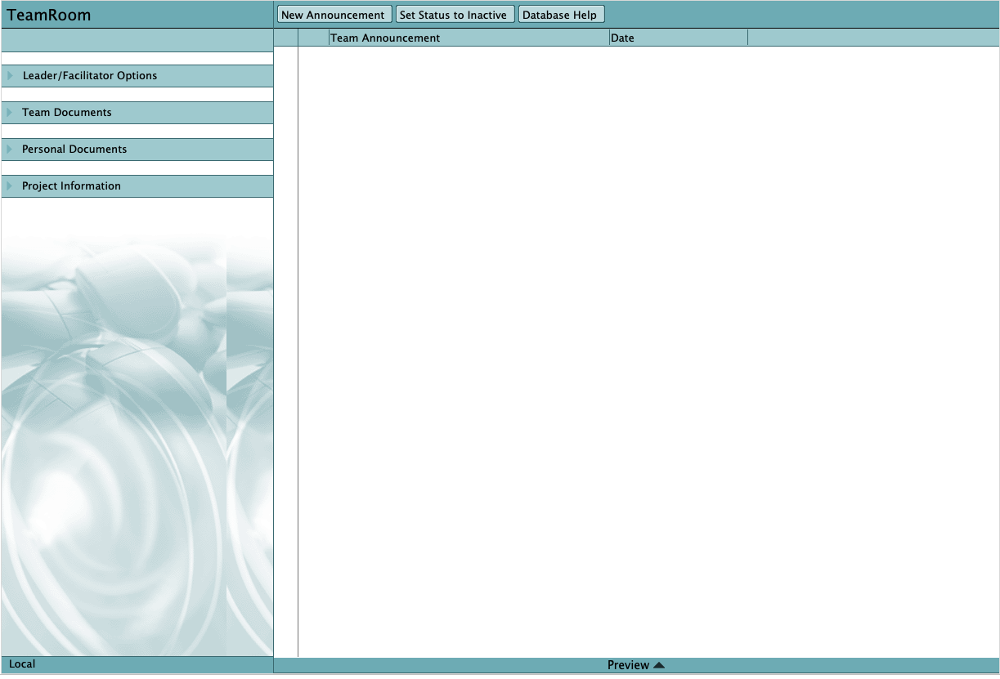

<h1>HCL Domino Teamroom Template</h1>

  

    Table of contents
  

  {: .text-delta }
1. TOC
{:toc}

## Info

Property | Value
---|---
Filename | teamrm12_EN.ntf
Templatename | StdR12TeamRoom
Template version | 12.0.1
Signed by | Open Source Template/Domino Development
Optimized for | Notes Client & Web

## What is TeamRoom?

TeamRoom is a HCL Notes application designed to support processes that help people work together.  The software does not create the sense of shared purpose, common language, focus, and drive which make effective teams productive.  But, by embedding in its technology a template for many of the basic practices of "good teaming," TeamRoom facilitates the creation and ongoing development of processes and practices common to high performance teams.

TeamRoom is a tool for information sharing and collaboration.  However, the work of a TeamRoom-based team is not fundamentally different than it was "before groupware."  By creating a shared context for team work, TeamRoom does what many good tools do: creates leverage, both for the individuals on the team and for the team as a whole.  Because the technology is built on a Notes groupware "sharing" platform, this context is richer and the leverage is greater than is typically possible with "sending" tools like Email.  Notes also makes it possible for TeamRoom to support teams whose members who are geographically distributed, and who are sometimes unable to be connected to their computer network.

- Examples of work made easier and more efficient by TeamRoom include:
- Raising & discussing issues and concerns
- Creating (collaborative) product:  memos, presentations, other "deliverables"
- Brainstorming (which, hopefully, leads to resolution and action)
- Preparing for meetings:  one can present and share information in the TeamRoom before the meeting, so that meeting time can be focused on decision making
- Tracking meeting agendas and resulting action items.

## Where to find more information?

More information can be found by pressing F1 while in any form in TeamRoom.  This will open extensive documentation found in the Notes Client Help database.  The Using Database document for this database also contains help information.  

Additional TeamRoom documentation, found on https://help.hcltechsw.com/notes/14.0.0/client/tasks_notes.html

## Access Control

* The default access of a database created with this template is "Author".  
* If you wish to make this a private TeamRoom, assign the default an access level of "No Access".  Add name(s) or group(s) of individuals who will be involved in this TeamRoom to the ACL.  These people/groups should have "Author" access.  
* The people listed in the TeamRoom Setup as the Team Facilitator and Team Leader should be given a minimum of "Editor" access.  This will allow them full use of the Leader/Facilitator Options. 
* If there are people other than the Leader/Facilitator who add categories, participants, etc., they should be added to the ACL with "Editor" access.  These people will also see all of the Team Leader/Facilitator options in the main outline of the TeamRoom.
* You may want to give Subteam leaders "Editor" access so they can modify subteam profiles, create subteam status documents, etc.
* You can add groups found in the Name & Address book to the Access Control List; these groups are not supported as Team Member names, however.
Important note: Anyone with Editor access or above can modify the TeamRoom Setup.

## Upgrading from Other Template Designs:

The TeamRoom template has been designed from the ground up to be compatible with the Discussion template.  This means that any R4.6 or higher Discussion database can be upgraded to a TeamRoom database by replacing the design with the TeamRoom template.

The TeamRoom template is now also compatible with the 4.1 release of the Lotus Institute TeamRoom.  After replacing the design of the 4.1 TeamRoom, you must run the agent "Convert 4.1 TeamRoom to new design".  This agent is hidden by default.  To make it available to use, edit the agent and change "When this agent should be run" to Manually from the Actions Menu.  It is recommended that you hide the agent after use, to avoid confusion.

## Alternate Name Support -- Upgrading from R5 TeamRoom

The Notes 6 (and future) TeamRoom provides support for Alternate Names.  The Subteam Details feature displays the names of the people assigned to a particular subteam.  Because R5 Subteam documents did not have alternate name support, the Subteam Details dialog box would only list primary names.  To update the Subteam documents, open the TeamRoom setup and click Manage Lists - Upgrade Subteams to New Design.

## Using the Notes 6 (and future) TeamRoom with an R5 Notes Client

The Main Document form in the TeamRoom has time zone support.  The time zone fields use @functions that are not supported in R5.  Therefore, R5 clients will not be able to create new Meeting documents or edit existing Meeting documents.
